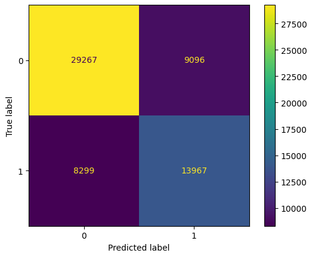

# Duplicate Question Detector

### Objectives

Website like Quora often receive multiple posts asking the same question. This can lead to users waiting for people to answer a question when they could instead be redirected to existing answers. The goal is to build a model that can compare two questions and determine if they are duplicate questions.

### Data
The model uses a dataset provided by Quora, labeled by human experts. 
The labeled dataset can be downloaded from [here](https://drive.google.com/file/d/19iWVGLBi7edqybybam56bt2Zy7vpf1Xc/view?usp=sharing).

### Process
1. Explore and clean the data
 - Most of the questions were written clearly and without many typos. I did find a small number of rows containing questions that were just one word, only punctuation or, or other strings of nonsense. These rows were removed.
 - Tokenized each question into individual words, removed punctuation, normalized and removed common stop words.
 - Stemmed word tokens
2. Feature Engineering
 - Converted the cleaned, tokenized and stemmed questions into TF IDF vectors
 - Added column for cosine similarity of these vectors
 - Added column for the ratio of words in common to total words between two questions
 - Converted cleaned, non-stemmed questions into sentence embeddings
 - Added column for cosine distance between embedding vectors
3. Model Testing
 - Random Forest Classifier using Grid Search CV

 ### Results
 My model was able to identify duplicate questions with an accuracy of 71.3% and a ROC-AUC score of 0.70. Below is the confusion matrix for the test on the validation data:
  
 

### Challenges and Future Work
This data had an imbalance in the target classes. Next steps would be to rerun the model using oversampling to balance out the training data. With more time, I would do more indepth data cleaning. I noticed during the EDA process that some rows were actually not labeled correctly (obvious duplicates labeled as non-duplicates). I also filtered out questions that were just one word long, but that probably left behind additional invalid questions that could have been removed. I was limited in my ability to use the full embedded vectors for each question in my models because of computing power.